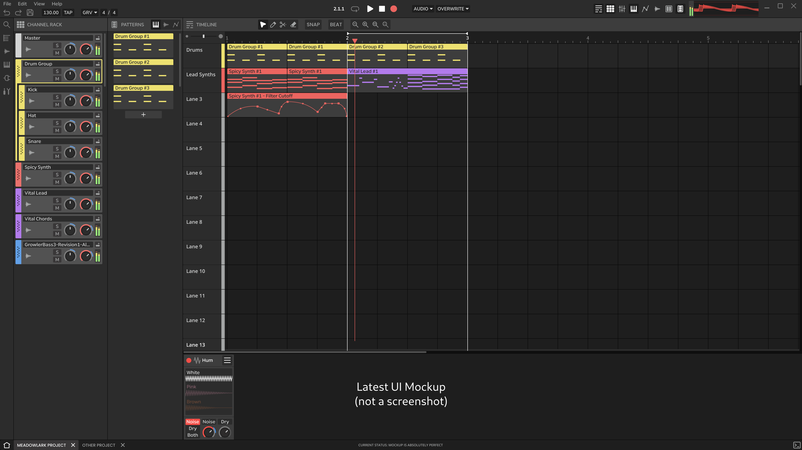

# Meadowlark UX Design Document

This document explains Meadowlark's UX (User Experience) design.

# Objective

Make a natural, intuitive and flexible workflow that packs power, versatility and options. Philosphically, we want to create a hybrid workflow that has the organizational capabilites of FL Studio, and the intuitive nature of more traditional DAW setups like Ableton Live. The goal is to overcome the flaws of the two systems and create something that's ultimately better and more capable than both.

There's no guarantee that our current workflow will meet our objective fully, since this kind of workflow has never actually existed. However, we think the system could be totally configurable, enough to allow a hybrid workflow and conventional track workflow within the same project on the same timeline.

# MVP Goals
* **A usable implementation of our timeline.** This will naturally include the channel rack and pattern panel. Together they should have the features for making a basic song.

* **Horizontal instrument/FX rack**, focused on **external plugin support.** We're happy to include your plugins if you have made them for Meadowlark, but we suspect most lines of code will be dedicated to Meadowlark's core functions and UI at this early stage.

* **A File browser for samples and plugins.** Fairly self explanatory, just a pane on the left to load samples and plugins into the channel rack, or directly onto the timeline.

* A very small **sample library.** This will likely consist of samples that have different bit rates, just to test the audio engine, but not a major library like you'd expect with a DAW. Of course, that's set for the future, and we currently plan to ship a compressed version of our full sample library with meadowlark, and offer a separate lossless sample pack for people who really want all the bits. Wouldn't it be fun if all the factory samples were made with Meadowlark?

# Non MVP Goals
* **A Mixer.** It may seem like we're missing a core DAW function by leaving this out, but in our system, the mixer is a bit of a redundant organ. The mixer will basically function as a less "instrument focused" view of the channel rack, where effects and synths are summarized as a list, rather than the full rack. It will still look and function exactly like the mixers you're used to already. We will include a mixer for more extensive routing, and because it's so widely recognized in the audio industry, but so far it's not MVP.

* **Stock plugins (Synths and FX).** Because we're a small team, we don't have the manpower to dedicate to creating DSP and audio plugins from scratch. We would love to do this, and we have plenty of ideas, but our time is best spent focusing on the actual DAW before we make plugins. For MVP, we will focus on allowing extenal plugins, because there are thousands of free ones readily available. If YOU would like to make plugins for Meadowlark, join us on [Discord], we'd love to chat with you!

[Discord]: https://discord.gg/2W3Xvc8wy4

# UX Design

Note that this is just a mockup and the final design is subject to change. Here is the most up-to-date mockup for Meadowlark:

### Design summary.
(Todo)

## Top Bar

### Section 1

* We start with the traditional "File/Edit/View/Help" dropdown menus. I feel these are pretty self-explanatory.

(From left to right)
* Undo/Redo buttons
* Save button
* The tempo in bpm at the current playhead. The user can drag on this widget like a slider to change this value, or they may double-click this box to enter a new tempo with the keyboard.
* When the user clicks this multiple times, it will set the bpm value to the left according to the rate at which they clicked it.
* Groove Menu - When the user clicks this, a dialog box with groove settings will appear (settings like swing and volume accents). *(This dialog box has not been designed yet.)*
* The time signature at the current playhead. The user can drag on this widget like a slider to change this value, or they may double-click this box to enter a new value with the keyboard.

### Section 2

(From left to right)
* Transport Display - The user can click on this to toggle between two different modes:
    * Musical time - This will display the time at the current playhead in (measures/beats/16th beats).
    * Real time - This will display the time at the current playhead in (hours/minuts/seconds/milliseconds).
* Loop Toggle Button - The user can click on this to toggle looping in the transport.
* Play button - The user clicks this to play/pause the transport.
* Stop button - The user clicks this to pause the transport and return to the beginning of the most recently seeked position.
* Record button - *(TODO: decide on recording workflow)*
* Record settings - *(TODO: decide on recording workflow)*

*TODO: Rest of the design doc.*
